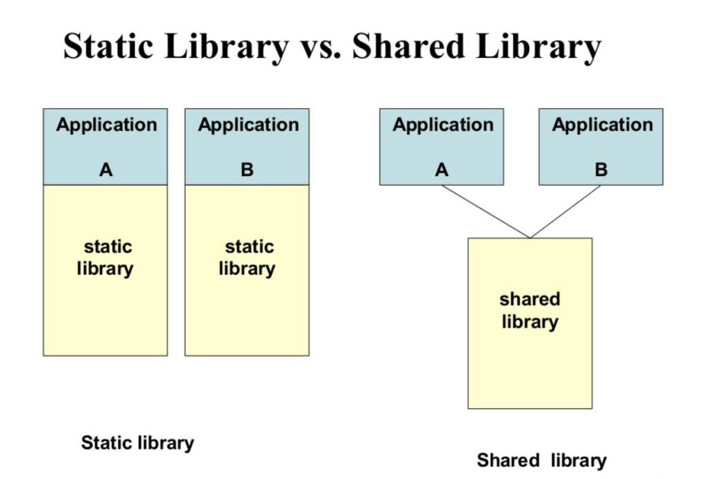

<style scoped>
* {
    text-align: center;
}
</style>


# Viettel Digtal Talent 2024

Software Engineering - Systems Development

Project: **Đóng gói Linux service vào .deb package**

Người thực hiện: Nguyễn Quang Trường

---

# Tổng quát

## Nội dung

- Shared library lấy thông tin về CPU và RAM của hệ thống;
- Linux service sử dụng shared library trên;
- Đóng gói service thành .deb package.

## Hệ thống

- C++17 (GNU GCC 12.3.0);
- Ubuntu 22.04 (Linux kernel 5.15.0, GLIBC 2.35, x86_64);
- systemd 249.11.

---

# Thông tin về CPU

Các công cụ như top/htop/btop đọc và xử lý thông tin từ `/proc/stat`.

https://gitlab.com/procps-ng/procps/-/blob/master/library/stat.c#L729
https://github.com/htop-dev/htop/blob/main/linux/LinuxMachine.c#L407
https://github.com/aristocratos/btop/blob/main/src/linux/btop_collect.cpp#L875

---

# Thông tin về CPU

- Các dòng đầu tiên của `/proc/stat` bao gồm thông tin của toàn bộ CPU và thông tin của các core riêng biệt;
- Đơn vị: 1/100 giây (trên hầu hết các hệ thống);

```bash
$ head -n9 /proc/stat
cpu  13000764 9507 2244913 74892485 972586 0 185645 0 705982 0                         
cpu0 1627644 413 282787 9286310 120868 0 23233 0 92085 0
cpu1 1680479 957 278270 9338707 118519 0 21156 0 89044 0
cpu2 1549828 845 284752 9410810 120622 0 48504 0 85688 0
cpu3 1667116 1351 296711 9332029 118666 0 3804 0 89494 0
cpu4 1669593 4997 268486 9349192 123495 0 4044 0 90480 0
cpu5 1553699 98 276142 9444654 124298 0 10193 0 84118 0
cpu6 1679272 692 274911 9356225 122835 0 5107 0 89354 0
cpu7 1573129 150 282852 9374554 123279 0 69601 0 85717 0
```

---

# Thông tin về CPU

- **user**: thời gian trong user mode;
- **nice**: thời gian trong user mode với độ ưu tiên thấp (low priority);
- **system**: thời gian trong system mode;
- **idle**: thời gian thực hiện idle task;
- **iowait**: thời gian chờ thực hiện các tác vụ I/O;
- **irq**: thời gian thực hiện hardware interrupt;
- **softirq**: thời gian thực hiện software interrupt;
- **steal**: thời gian trong các OS khác trong môi trường ảo hóa;
- **guest**: thời gian chạy CPU ảo cho các guest OS dưới sự kiểm soát của Linux kernel;
- **guest_nice**: thời gian chạy guest với độ ưu tiên thấp (low priority).

---

# Thông tin về CPU

- **idle** và **iowait** là các trạng thái nghỉ (idle);
- **guest** và **guest_nice** được tính vào **user** và **nice**;
- Các trạng thái còn lại là trạng thái hoạt động (work).

Tại mỗi thời điểm đọc `/proc/stat`, có thể tính được tổng thời gian trong toàn bộ trạng thái (total) và tổng thời gian trong trạng thái hoạt động (work) kể từ lúc khởi động hệ thống.

---

# Thông tin về CPU

```cpp
struct Jiffies {
    unsigned long long total;
    unsigned long long work;
};

std::optional<Jiffies> parse_from_system() {
    std::ifstream in("/proc/stat");

    if (!in) {
        return std::nullopt;
    }

    std::string label;
    unsigned long long user, nice, system, idle, iowait, irq, softirq, steal;
    in >> label >> user >> nice >> system >> idle >> iowait >> irq >> softirq >> steal;

    Jiffies result;
    result.total = user + nice + system + idle + iowait + irq + softirq + steal;
    result.work  = user + nice + system + irq + softirq + steal;
    return result;
}
```

---

# Thông tin về CPU

CPU usage: tỉ lệ thời gian CPU ở trạng thái work trong một khoảng thời gian (interval).
Cách thực hiện tính toán sẽ như sau:

- Lấy thông tin về CPU trước và sau một khoảng thời gian (interval) tùy ý;
- Kết quả là chênh lệch thời gian trong trạng thái work chia cho chênh lệch thời gian tổng.

```cpp
const auto previous_jiffies = parse_from_system();
std::this_thread::sleep_for(std::chrono::milliseconds(interval));
const auto current_jiffies = parse_from_system();

const auto total_diff = current_jiffies->total - previous_jiffies->total;
const auto work_diff = current_jiffies->work - previous_jiffies->work;

result = 1.0f * work_diff / total_diff;
```

---

# Thông tin về CPU

Interface của thư viện có dạng:

```cpp
extern "C" float jaltop_cpu_usage(int interval_ms);
```

- `interval_ms == 0`: CPU usage sẽ được tính từ thời điểm cuối cùng `/proc/stat` được parse bởi thư viện đến thời điểm function được gọi;

- `interval_ms != 0`: thư viện sẽ parse lại `/proc/stat` hai lần (cách nhau `interval_ms` mili giây) để tính CPU usage.

---

# Thông tin về RAM

Thông tin về RAM cũng có thể được truy xuất thông qua `/proc`. Tuy nhiên, Linux kernel có cung cấp sẵn system call `sysinfo()`.

```cpp
#include <sys/sysinfo.h>
#include <limits>

constexpr auto NaN = std::numeric_limits<float>::quiet_NaN();

extern "C" float jaltop_ram_usage() {
    struct sysinfo sysinfo;
    const auto retval = ::sysinfo(&sysinfo);

    if (retval != 0) {
        return NaN;
    }

    return 1.0f * (sysinfo.totalram - sysinfo.freeram) / sysinfo.totalram;
}
```

---
<style scoped>
img {
    display: block;
    margin: 0 auto;
}
</style>

# Shared library



- Là một object file được chia sẻ giữa các chương trình khác nhau;
- Nạp tại lúc thực thi, thay vì được chèn vào mã máy của chương trình tại lúc biên dịch;
- Một số ưu điểm như cải thiện memory, storage, thời gian load và cả hiệu năng trong một số trường hợp.

---

# Shared library

```cpp
#include "libjaltop.hpp"

#include <iostream>

int main() {
    std::cout << jaltop_cpu_usage(0) << ' ' << jaltop_ram_usage() << '\n';
}
```

```x86asm
00000000000010f0 <jaltop_cpu_usage@plt>:
    10f0:	f3 0f 1e fa          	endbr64 
    10f4:	f2 ff 25 cd 2e 00 00 	bnd jmp QWORD PTR [rip+0x2ecd] # 3fc8 <jaltop_cpu_usage@Base>
    10fb:	0f 1f 44 00 00       	nop    DWORD PTR [rax+rax*1+0x0]

0000000000001100 <main>:
    1100:	f3 0f 1e fa          	endbr64 
    1104:	53                   	push   rbx
    1105:	31 ff                	xor    edi,edi
    1107:	e8 e4 ff ff ff       	call   10f0 <jaltop_cpu_usage@plt>
    # ... omitted
```

---

# Shared library

```x86asm
(gdb) disas 'jaltop_cpu_usage@plt'
Dump of assembler code for function jaltop_cpu_usage@plt:
  0x00000000000010f0 <+0>:     endbr64  
  0x00000000000010f4 <+4>:     bnd jmp QWORD PTR [rip+0x2ecd] # 0x3fc8 <jaltop_cpu_usage@got.plt>
  0x00000000000010fb <+11>:    nop    DWORD PTR [rax+rax*1+0x0]
End of assembler dump.
(gdb) disas 'jaltop_cpu_usage@got.plt'
No function contains specified address.
(gdb) b main
Breakpoint 1 at 0x1100: file examples/main.cpp, line 5.
(gdb) r
Starting program: /home/jalsol/Documents/libjaltop/build/main  
[Thread debugging using libthread_db enabled]
Using host libthread_db library "/lib/x86_64-linux-gnu/libthread_db.so.1".

Breakpoint 1, main () at examples/main.cpp:5
5       int main() {
(gdb) disas 'jaltop_cpu_usage@got.plt'
Dump of assembler code for function jaltop_cpu_usage(int):
  0x00007ffff7fb7790 <+0>:     endbr64  
  0x00007ffff7fb7794 <+4>:     push   rbx
  0x00007ffff7fb7795 <+5>:     movsxd rbx,edi
  0x00007ffff7fb7798 <+8>:     sub    rsp,0x60
  # ... omitted
```

---

# Shared library

```make
CC=g++
CFLAGS=-std=c++17 -Wall -Wextra -O2 -Iinclude

all:
    $(CC) $(CFLAGS) -o build/libjaltop.so -fPIC -shared src/cpu.cpp src/ram.cpp

clean:
    rm build/*.so
```


- `-shared`: xây dựng shared library;
- `-fPIC`: đảm bảo trình biên dịch sẽ xuất ra Position Independent Code (PIC) - code mà không phụ thuộc vào vị trí (ví dụ: các lệnh `jmp` sẽ sử dụng vị trí tương đối với register `rip` thay vì tuyệt đối).

---

# Linux service

Ví dụ: kiểm soát những thông số CPU và RAM của các máy tính trong cùng một mạng.

Để minh họa đơn giản, một HTTP server có khả năng gửi các thông số về CPU và RAM usage được xây dựng.

https://github.com/jalsol/jaltop/blob/master/src/main.cpp

---

# Linux service

Tạo unit file `/etc/systemd/system/jaltop.service` với nội dung:

```toml
[Unit]
Description=just a little TOP (service)
StartLimitIntervalSec=0
 
[Service]
User=root
ExecStart=/usr/bin/jaltop
Restart=always
RestartSec=1

[Install]
WantedBy=multi-user.target
```

---

# Debian package

Giả sử package có tên là `jaltop_0.2-1`.

```
 jaltop_0.2-1
 ├── DEBIAN
 │  └── control
 ├── etc
 │  └── systemd
 │     └── system
 │        └── jaltop.service
 └── usr
    ├── bin
    │  └── jaltop
    └── lib
       └── libjaltop.so
```

Ví dụ, sau khi cài đặt package, file `jaltop_0.2-1/usr/lib/libjaltop.so` sẽ được cài đặt tại `/usr/lib/libjaltop.so`.

---

# Debian package

Nội dung của `DEBIAN/control` có dạng như sau:

```
Package: jaltop
Version: 0.2-1
Section: testing
Priority: optional
Architecture: amd64
Maintainer: Quang-Truong Nguyen <jalsol@protonmail.com>
Description: just a little TOP
```

---

# Debian package

```bash
# đóng gói package
$ dpkg-deb --build jaltop_0.2-1

# cài đặt package
$ dpkg -i jaltop_0.2-1.deb

# gỡ cài đặt package
$ apt remove jaltop
```

---


